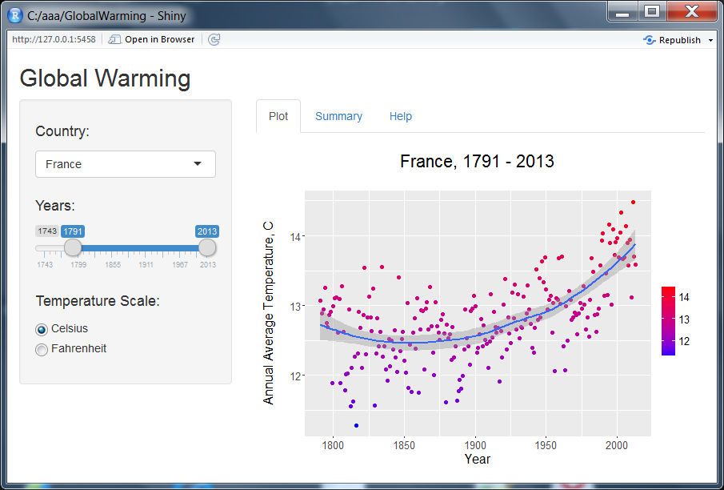

Global Warming's Data Visualization
========================================================
author: Dmitry Belyaev
date: May 06, 2016

Developing Data Products - Course Project

Problem Description and DataSets
========================================================

- Global Warming is the increase of the average temperature of Earth's climate system. The term Global Warming is often used to refer to the average temperature of the land surface.

- The described application illustrates the change of the global average temperature in different countries.

- The raw dataset GlobalLandTemperaturesByCountry.csv was taken from the dataset's archive in the Kaggle Datasets repository - https://www.kaggle.com/berkeleyearth/climate-change-earth-surface-temperature-data.

- Data cleaning and preprocessing (NA's omitting and calculating the annual average temperatures) was done by the script - https://github.com/dvbelyaev/DDP_GlobalWarming/blob/master/preproc.R

Example of the Data Visualization
========================================================
left: 55%

***

**Relative annual average temperature change:**

- from **13.1 C** in the **1791** year
- to **13.6 C** in the **2013** year
- change: **0.5 C**

**Absolute annual average temperature difference:**

- min. **11.3 C** in the **1816** year
- max. **14.5 C** in the **2011** year
- difference: **3.2 C**

"Global Warming" Shiny Application
========================================================
left: 70% 

https://dvbelyaev.shinyapps.io/GlobalWarming/

***

To visualize data:

- select **Country**
- choose the interval of **Years**
- set the **Temperature Scale**

To get data summary select panel **Summary**

Useful Links
========================================================

- These presentation and application were produced for the homework assignment of Developing Data Products course from Johns Hopkins University - https://www.coursera.org/learn/data-products/

- The source code of the "Global Warming" application and slides of presentation could be found on GitHub - https://github.com/dvbelyaev/DDP_GlobalWarming/

- The many other datasets devoted to the problems of Climate change and Global Warming are available at the Berkeley Earth data repository - http://berkeleyearth.org/data/

Hope you enjoy using the app.

Thank you!
